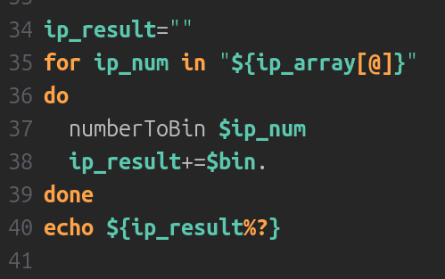

# Отчет по лабораторной работе 2
*Выполнил __Малыхин Никита Сергеевич__* 

## Цель
Написать скрипт, который на вход принимает IPv4-адрес в десятичном формате, а на выходе обеспечивает данный IP-адрес в двоичном формате.

Пример входных данных:

```192.168.10.1```

Пример выходныx данных:

```11000000.10101000.00001010.00000001```

## Решение 

### 1. Создание файла


1. Создаем файл с расширением .bash
2. Уĸажим путь ĸ bash-интерпретатору, используя последовательность символов shebang
3. Присваиваем переменной ```ip``` значение первого аргумента - ip адреса

### 2. Заполняем массив числами ip адреса


1. Создаем массив с цифрами
2. Заполняем его до тех пор, пока не попадется точка
3. Добавляем получившееся число в массив со всеми числами
4. Та же операция со оставшимися числами
5. Получаем массив с числами ip адреса

### 3. Создаем функцию преобразования числа в двоичную систему


1. Добавляем остаток от деления на 2 в строку
2. Делим число целлочисленно на 2
3. Повторяем, пока не заполним всю строку

### 4. Получаем ip адрес в двоичной записи


1. Проходимся по всем числам ip адреса
2. Применяем к каждому числу созданную ранее функцию ```numberToBin```
3. Выводим получившийся результат

## Примеры работы программы


## Вывод
Разработал скрипт для преобразования десятичного ip адреса в двоичный вид